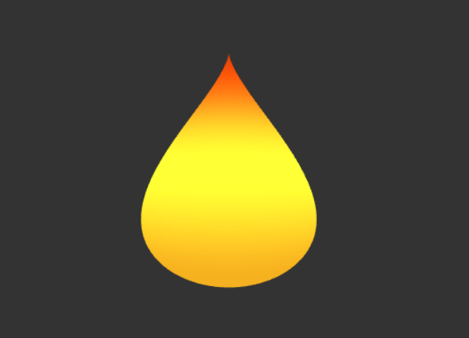
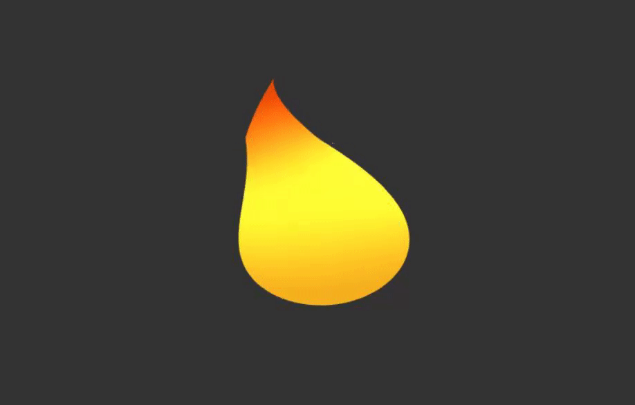
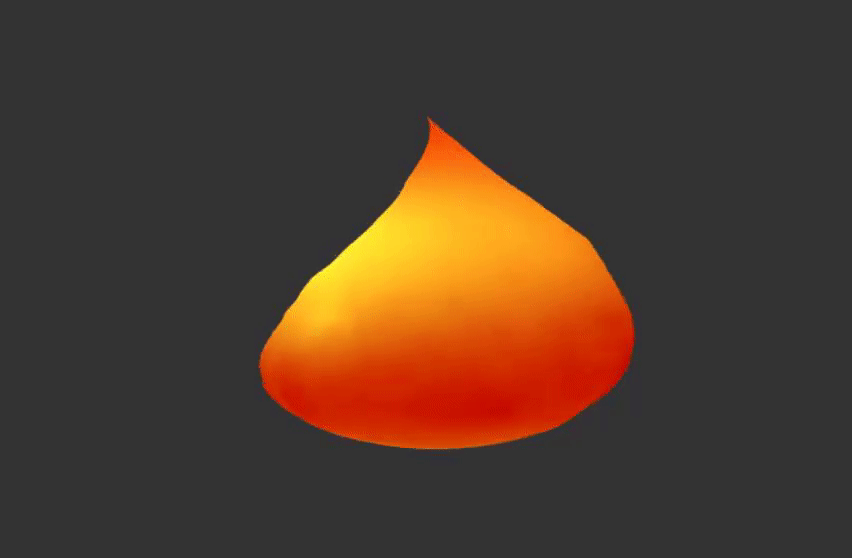
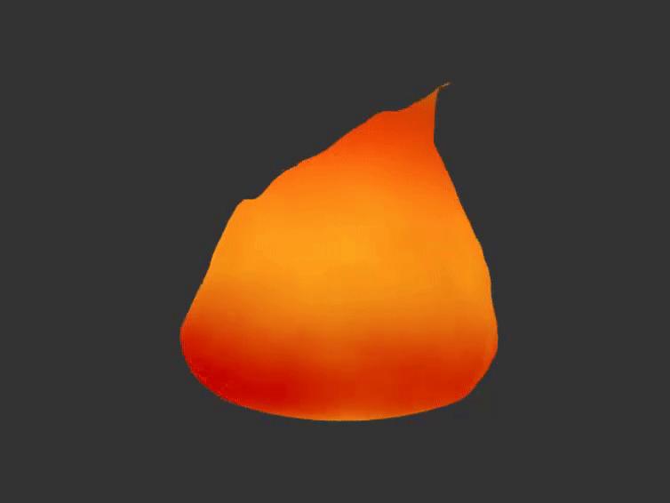
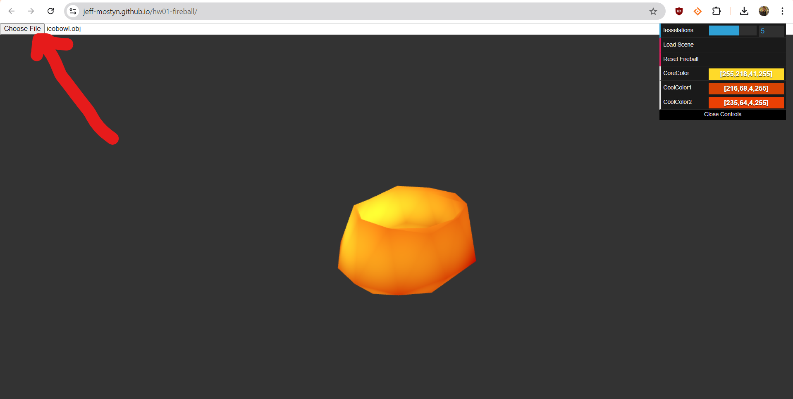

# [Project 1: Noise](https://github.com/CIS-566-Fall-2022/hw01-fireball-base)

## Procedural Fireball

Starting with an icosphere, I used a compination of sinusoid functions, noise functions, and standard toolbox functions to create a fireball from procedural deformation and coloring.

# Base Shape

Used bias function to shape the vertices of the icosphere into the shape of a flame

# Semi-Realistic Flicker

Applied a series of offset sinusoid functions of varying periods and amplitudes to create a semi-random appearing flicker effect

# FBM Distortion

Utilized Perlin Noise-based Fractal Brownian Motion to apply xz-plane distortion to the lower portions of the mesh, creating a feeling of non-uniformity

# Height Distortion

Using 4 instances of Perlin Noise, one coming from each of the left, right, front, and back, added vertical distortion that appears to move towards the center point of the flame. Based on distance from central y axis, the magnitude of the distortion is interpolated so that the mesh appears without seams or stretching on the sides.

# Custom OBJ Import

You can use the file browser to import a custom .obj file that will have the fireball shaders applied to it. If the button to do so does not show up on the screen, you may need to tab through the page until focus reaches it. You will have the proper quality if all vertices of the .obj file lie within the [-1, 1] space in each axis

## Submission

- Update README.md to contain a solid description of your project
- Publish your project to gh-pages. `npm run deploy`. It should now be visible at http://username.github.io/repo-name
- Create a [pull request](https://help.github.com/articles/creating-a-pull-request/) to this repository, and in the comment, include a link to your published project.
- Submit the link to your pull request on Canvas.
